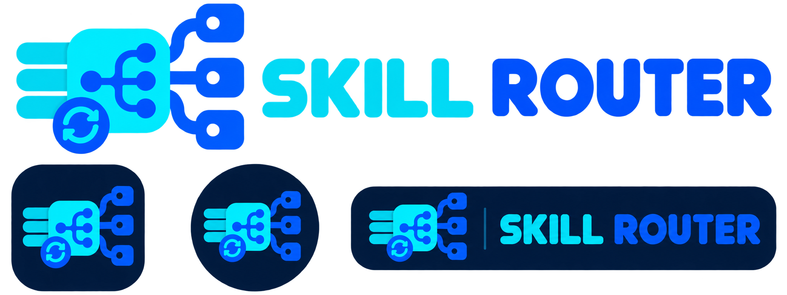
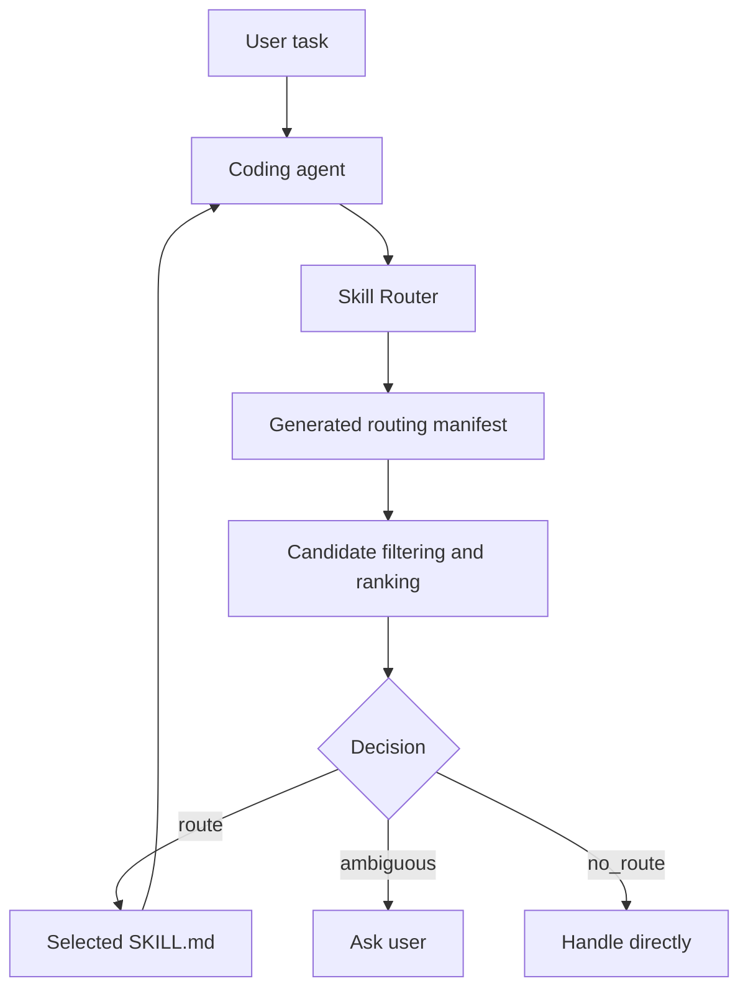

<p align="center">
  
</p>

<p align="center"><strong>Deterministic skill discovery and routing for AI coding agents.</strong></p>

<p align="center">
  <a href="LICENSE"></a>
  
</p>

# Skill Router

Skill Router indexes a repository's `SKILL.md` skills and recommends the smallest relevant skill set for a task. It is a **router, not an executor**: the agent receives a deterministic recommendation, checks it against the task, loads the selected skill, and decides what to do.

## Why it exists

As a skill library grows, reading every skill on every request wastes context and makes overlapping skills difficult to distinguish. Skill Router keeps compact generated metadata in a routing manifest, filters candidates cheaply, ranks the candidates using structured signals, and returns one of three safe outcomes:

- `route` — a clear skill (or minimal ordered plan) is recommended.
- `ambiguous` — candidates are too close; the agent should ask for clarification.
- `no_route` — no installed skill is relevant; handle the task normally.

## How it works



Routing reads generated metadata rather than the full skill library. The selected `SKILL.md` is loaded only after routing. The router never runs a returned command.

## Features

- Two-stage, deterministic routing with `route`, `ambiguous`, and `no_route` decisions.
- Positive and negative boundaries (`use_when` and `not_when`) for near-neighbor skills.
- Structured matching across intents, objects, actions, capabilities, aliases, and domains.
- Minimal ordered multi-skill plans for genuinely separate task dimensions.
- Generated registry and routing manifest with fingerprint-based cache invalidation.
- Conservative bootstrap for existing or empty agent repositories.
- Validation, drift detection, debug scoring, and a gold-set benchmark.
- Agent-neutral `SKILL.md` core with selectable agent directory layouts.

## Supported agents and layouts

Skill Router's skill package uses the portable directory format `skill-router/SKILL.md` with YAML frontmatter containing `name` and `description`. The routing engine itself is agent-neutral.

| Environment | Project skill directory | User-level directory | Status |
|---|---|---|---|
| Generic `SKILL.md` agents | `.agents/skills/` | `~/.agents/skills/` | Implemented and tested by the installer |
| Claude Code | `.claude/skills/` | `~/.claude/skills/` (manual copy) | Layout addressed; project installer supported |
| DeepSeek Harness | `.dsh/skills/` | `~/.agents/skills/` | Layout addressed; project installer supported |

Claude Code and DeepSeek Harness consume the same `SKILL.md` contract; Skill Router does not claim an agent-specific plugin or native command integration. DeepSeek Harness also recognizes `.agents/skills/`; its project-local `.dsh/skills/` directory is available through `--agent deepseek`. If your agent uses another location, use `--agent generic` and copy the generated package into that agent's documented skill directory.

## Requirements

- Python 3.10 or newer (standard library only; no third-party dependencies).
- A coding agent that can discover directory-based `SKILL.md` skills.
- On Windows, use `py` in place of `python3` when needed.

## Quick start

From a clone of this repository:

```bash
python3 install.py
# Choose 1 (Global) or 2 (Project) before anything is written.
```

Then verify the installed CLI. The installer prints the exact path; the forms are:

```bash
# project installation
python3 .skill-router/skill.py --version
python3 .skill-router/skill.py doctor --root .

# global installation
python3 ~/.skill-router/skill.py --version
# Diagnose a particular agent repository with the global CLI:
python3 ~/.skill-router/skill.py doctor --root /path/to/agent-repo
```

A successful `doctor` report has `"ok": true`. For a project that already contains skills, initialize its generated metadata first:

```bash
python3 .skill-router/skill.py bootstrap --root .
python3 .skill-router/skill.py validate --root .
```

Start a new agent session after installing so it can rediscover the skill directory.

## Installation

The installer shows the scope, agent layout, and every destination **before** it changes the filesystem. It refuses to overwrite an existing file unless `--upgrade` is explicit.

### Global installation

Global installation places the skill at `~/.agents/skills/skill-router/` (or `~/.claude/skills/skill-router/` with `--agent claude`) and the CLI at `~/.skill-router/skill.py`. This makes the skill available to compatible projects for the current user. It does not edit `PATH`, shell profiles, agent settings, or unrelated skill files.

```bash
python3 install.py --scope global --agent generic
# non-interactive / CI-friendly confirmation:
python3 install.py --scope global --agent generic --yes
```

Use `--agent claude` for Claude Code's native project or user layout. The default `generic` and `deepseek` choices use the shared `~/.agents/skills` location.

### Project installation

Project installation writes only inside the selected project:

```bash
python3 install.py --scope project --agent generic --project /path/to/project
python3 install.py --scope project --agent claude --project /path/to/project
python3 install.py --scope project --agent deepseek --project /path/to/project
```

The project layout has higher practical precedence than the same user's global skill in agent implementations that support both scopes. Skill Router itself does not merge or execute skills; the host agent owns duplicate resolution. Keep one project copy when deterministic behavior matters.

### Upgrade and uninstall

Both operations are explicit and previewable. They affect only the three Skill Router files shown by the installer:

```bash
python3 install.py --scope project --upgrade --yes
python3 install.py --scope project --uninstall
```

For global operation, add `--scope global`. If an existing destination is not a Skill Router file, installation stops instead of overwriting it.

## First usage

For an existing skill repository, bootstrap once, then synchronize after every skill change:

```bash
python3 skill.py bootstrap --root /path/to/agent-repo
python3 skill.py sync --root /path/to/agent-repo
python3 skill.py route "check the accessibility of our dashboard against wcag" \
  --root /path/to/agent-repo
```

The route response is JSON. It includes the decision, selected skill, validated command, confidence, and evidence. Add `--debug` for candidate scores and penalties. The router recommends; the host agent must sanity-check the selected skill before loading or executing anything.

## Examples

### One clear match

```bash
python3 skill.py route "scan our login endpoint for vulnerabilities" --root ./agent-repo
# decision: route -> security-review
```

### Overlapping candidates

```bash
python3 skill.py route "review my writing" --root ./agent-repo
# decision: ambiguous; ask whether the user wants grammar, style, or human-like prose review
```

### Multi-skill work

```bash
python3 skill.py route "write a readme and draft the marketing blurb for the api" \
  --root ./agent-repo
# decision: route; ordered skills include docs-writing and copywriting
```

### Project scope

```bash
python3 install.py --scope project --agent generic --project .
python3 .skill-router/skill.py bootstrap --root .
python3 .skill-router/skill.py route "write a README for this API" --root .
```

## Skill discovery and adding skills

The source of truth is a directory under `<root>/skills/<name>/` containing `SKILL.md` and `manifest.json`. A skill manifest must register only commands that really exist. Routing boundaries make selection safer:

```json
{
  "name": "my-skill",
  "description": "Reviews database migrations.",
  "use_when": ["review a database migration"],
  "not_when": ["review frontend visual design"],
  "objects": ["database", "schema"],
  "actions": ["review"]
}
```

Copy `templates/manifest.json`, fill in the metadata, and run:

```bash
python3 skill.py sync --root .
python3 skill.py validate --root .
python3 skill.py route "review this database migration" --root . --debug
```

`skill-registry/registry.json` and `skill-registry/routing-manifest.json` are generated artifacts. Do not edit them by hand. Project manifests are authoritative; project-generated metadata is intentionally separate from user-global metadata.

When several skills match, the router uses explicit boundaries and structured scores. A clear winner returns `route`; a near tie returns `ambiguous`; separate strong dimensions may produce a minimal ordered plan. It never silently executes the plan.

## Configuration

Defaults live in `CONFIG` in `skill.py`. To override supported values without editing code, set `SKILL_ROUTER_CONFIG` to a JSON file:

```json
{"route_floor": 0.50, "ambiguity_gap": 0.12, "max_candidates": 20}
```

```bash
SKILL_ROUTER_CONFIG=/path/to/router-config.json python3 skill.py route "..." --root .
```

The environment configuration is process-local and overrides built-in defaults. There is no checked-in global/project config merger. Use the same environment variable in the agent process if a project needs an override. `--no-cache` bypasses the route cache for one request.

## Directory structure

```text
.
├── SKILL.md                         # agent-facing skill instructions
├── skill.py                         # routing engine and CLI
├── install.py                       # safe global/project installer
├── manifest.json                     # this skill's metadata
├── skills/<name>/                    # installed skill sources (in target repos)
├── skill-registry/                   # generated indexes (in target repos)
├── templates/                        # manifest and agent contract templates
├── benchmarks/                       # corpus, gold set, benchmark runner
├── docs/                             # detailed documentation
├── tests/                            # regression tests
└── assets/icon/                      # official supplied artwork
```

For detailed documentation, see [`docs/`](docs/).

## Troubleshooting

| Symptom | Check |
|---|---|
| `doctor` reports missing metadata | Run `bootstrap --root <repo>` then `sync`. |
| A new skill is not routed | Ensure its folder has `manifest.json`, add routing boundaries, then run `sync`. |
| `validate` reports drift | Do not edit generated JSON; run `sync` after changing a manifest. |
| Install refuses to overwrite | Inspect the displayed destination; use `--upgrade` only for a known Skill Router install. |
| Agent cannot see the skill | Confirm the directory for that agent, restart the session, and use `doctor` for the CLI root. |
| Windows command not found | Use `py install.py` and `py .skill-router\\skill.py ...`. |

## Development and testing

Run the complete stdlib-only regression suite:

```bash
python3 tests/run_tests.py
```

Run the benchmark and inspect the generated decision output:

```bash
python3 skill.py benchmark
python3 skill.py route "review this pull request for unnecessary complexity" --debug
```

The tests cover positive and negative routing, ambiguity, no-route, multi-skill plans, cache invalidation, drift, V1 manifest compatibility, bootstrap idempotency, CLI smoke paths, validation exit codes, and benchmark execution. The installer is exercised with dry-run, project/global destination planning, safe overwrite behavior, and install output tests.

## Contributing

1. Create a focused branch and change the smallest relevant component.
2. Update a skill's `manifest.json` before changing generated registry files.
3. Run `python3 skill.py sync --root .`, `python3 skill.py validate --root .`, and `python3 tests/run_tests.py`.
4. Add a regression case for routing changes and explain benchmark impact.
5. Keep agent-specific behavior in adapters/layout choices rather than in the core matcher.

Please report reproducible routing failures with the request, relevant manifest, `--debug` output, Python version, and agent layout. Do not include secrets or private source code.

## License

Skill Router is released under the [MIT License](LICENSE).
